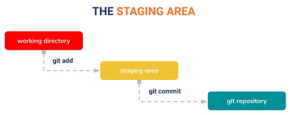

# (1) Versioning Control with Git
## Resume
Dalam materi ini mempelajari:
1. Versioning atau Versioning Control System
2. Git & Github
3. Workflow Collaboration

### Versioning atau Versioning Control System
Versioning atau Versioning Control System merupakan sebuah sistem yang merekam perubahan-perubahan dari sebuah atau sekumpulan berkas dari waktu ke waktu, sehingga dapat mengatur versi dari source code program. 

Terdapat beberapa Tools di dalam versioning, yaitu:
- Version Control System (VCS)
- Source Code Menager (SCM)
- Revision Control System (RCS)

Pada Versioning Control System juga terdapat 3 jenis, diantaranya:
- Single User
- Centralized (Terpusat)
- Distributed (not centralized)

### Git & Github
Salah satu version control system populer yang digunakan para developer untuk mengembangkan software secara bersama-sama. Git termasuk distribusi tidak terpusat yang dibuat oleh Linus Torvalds (2005). Git dapat digunakan untuk menyimpan berkas/project yang nantinya mengalami perubahan/revisi dari waktu ke waktu seperti codingan, file, dll. 

Git dapat melacak setiap perubahan file: Your changes, John's changes, everyone. Git dapat membatalkan untuk beberapa "point", disebut dengan Commit (catatan perubahan). 

Cukup rumit untuk mengatur server git, dibutuhkan layanan untuk menjadi server (Github = git hosting service). Github merupakan layanan hosting git, yang dapat dibuka di github.com. Git dapat diinstall pada Windows, Mac, dan Linux.

- Pada Working directory membuat perubahan pada file, kemudian Tambah file baru: `git add <nama file>`
- atau tambah beberapa file/folder baru atau ubah beberapa file/folder sekaligus `git add .` untuk memasukkan ke dalam stagging area
- Konfirmasi penambahan atau perubahan file `git commit -m "<pesan commit>"`
- Kirim perubahan ke dalam repository `git push origin <nama branch>`

Pada Github, dapat pula melakukan beberapa perintah, diantaranya: git (status, add, commit, push, pull, branch, rollback, diff, reset, merge).

### Workflow Collaboration
**Bagaimana cara megoptimalkan kolaborasi dalam development?**

Dalam kolaborasi tim tidak bisa hanya bekerja dalam satu branch, perlu dibuat beberapa branch agar kolaborasi optimal. Contoh branch yang digunakan dalam mendevelop suatu project:

1. Buat branch master dari branch development 
`$ (master) git branch development`
`$ (master) git checkout development`
2. Hindari direct edit ke branch Development
`$ (development) git branch feature1`
`$ (development) git checkout feature1`
3. Merge branch Feature hanya ke branch Development
`$ (feature1) git checkout development`
`$ (development) git merge feature1`
4. Merge Branch Development ke Branch Master jika Development selesai
`$ (master) git merge development`

